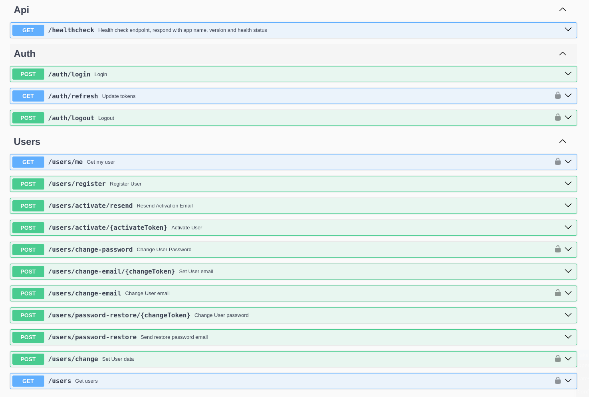

# NestJS Starter Kit v3

## Features

- TypeORM (Postgres), Migrations, Seeding
- OpenAPI/Swagger: cli `swagger/plugin` allows to take all info which is defined in Typescript code to Swagger specification automatically 
- Auth (JWT) and Users full-fledged modules/endpoints with RBAC (see below)
- Sending mail (Nodemailer or SendGrid), catch with MailHog
- Config, Validation
- Logger (Winston), LoggerMiddleware
- Health check
- Unit and e2e test examples
- Enhanced ESLinters
- CI (GitHub Actions)
- Docker setup


## Endpoints



## Run

### Start with local node 

Checked on node v20

```
pnpm install
cp ./example.env ./.env
docker compose up postgres mailhog
pnpm run start:dev
```

### Start all in Docker
`docker compose up`

### Data
Seed demo data:
`pnpm run console:dev job seed`

Go to http://localhost:3000

### Stop

Stop Docker containers
`docker compose stop`

---
See also [NestJS-Starter-Kit v2](https://github.com/ArtuGit/NestJS-Starter-Kit/tree/v2)
